Strack.io is a **desktop app for Homemade food sellers to manage contacts of their customers, optimized for use via a Command Line Interface** (CLI) while still having the benefits of a Graphical User Interface (GUI). If you can type fast, Strack.io can get your contact management tasks done faster than traditional GUI apps.

* Table of Contents
{:toc}

--------------------------------------------------------------------------------------------------------------------

## Quick start

1. Ensure you have Java `11` or above installed in your Computer.

1. Download the latest `addressbook.jar` from [here](https://github.com/se-edu/addressbook-level3/releases).

1. Copy the file to the folder you want to use as the _home folder_ for your AddressBook.

1. Open a command terminal, `cd` into the folder you put the jar file in, and use the `java -jar addressbook.jar` command to run the application. 
   A GUI similar to the below should appear in a few seconds. Note how the app contains some sample data. 
   

1. Type the command in the command box and press Enter to execute it. e.g. typing **`help`** and pressing Enter will open the help window. 
   Some example commands you can try:

   * `list` : Lists all contacts.

   * `add n/John Doe p/98765432 e/johnd@example.com a/John street, block 123, #01-01` : Adds a contact named `John Doe` to the Address Book.

   * `delete 3` : Deletes the 3rd contact shown in the current list.

   * `clear` : Deletes all contacts.

   * `exit` : Exits the app.

1. Refer to the [Features](#features) below for details of each command.

--------------------------------------------------------------------------------------------------------------------

## Features

**:information_source: Notes about the command format:** 

* Words in `UPPER_CASE` are the parameters to be supplied by the user. 
  e.g. in `add n/NAME`, `NAME` is a parameter which can be used as `add n/John Doe`.

* Items in square brackets are optional. 
  e.g `n/NAME [t/TAG]` can be used as `n/John Doe t/friend` or as `n/John Doe`.

* Items with `…`​ after them can be used multiple times including zero times. 
  e.g. `[t/TAG]…​` can be used as ` ` (i.e. 0 times), `t/friend`, `t/friend t/family` etc.

* Parameters can be in any order. 
  e.g. if the command specifies `n/NAME p/PHONE_NUMBER`, `p/PHONE_NUMBER n/NAME` is also acceptable.

* Extraneous parameters for commands that do not take in parameters (such as `help`, `list`, `exit` and `clear`) will be ignored. 
  e.g. if the command specifies `help 123`, it will be interpreted as `help`.

* If you are using a PDF version of this document, be careful when copying and pasting commands that span multiple lines as space characters surrounding line-breaks may be omitted when copied over to the application.

### Viewing help: `help`

You can show a message explaining how to access the help page.

Format: `help`

### Adding a customer: `add`

You can add a customer to your address book.

Format: `add n/NAME p/PHONE_NUMBER e/EMAIL a/ADDRESS [t/TAG]…​`

:bulb: **Tip:**
A person can have any number of tags (including 0)

Examples:
* `add n/John Doe p/98765432 e/johnd@example.com a/John street, block 123, #01-01`
* `add n/Betsy Crowe t/friend e/betsycrowe@example.com a/Newgate Prison p/1234567 t/criminal`

### Listing all customers and orders: `list`

You can show a list of all customers and orders in your address book.

Format: `list`

### Editing a person: `edit`

You can edit an existing customer in your address book.

Format: `edit c/CUSTOMER_ID [n/NAME] [p/PHONE] [e/EMAIL] [a/ADDRESS] [t/TAG]…​`

* Edits the person of the specified `CUSTOMER_ID`. The customer_id refers to the number shown in the customers's contact under "customer id". The customer id **must be a positive integer** 1, 2, 3, …​
* At least one of the optional fields must be provided.
* Existing values will be updated to the input values.
* When editing tags, the existing tags of the customer will be removed i.e adding of tags is not cumulative.
* You can remove all the person’s tags by typing `t/` without
    specifying any tags after it.

Examples:
*  `edit c/1 p/91234567 e/johndoe@example.com` Edits the phone number and email address of the person with customer_id of 1 to be `91234567` and `johndoe@example.com` respectively.
*  `edit c/2 n/Betsy Crower t/` Edits the name of the person with customer_id of 2 to be `Betsy Crower` and clears all existing tags.

### Locating customers and orders: `find`

You can find customers based on name, phone number, address or email and find orders based on order index.

Format: `find [n/NAME] [a/ADDRESS] [p/PHONE_NUMBER] [e/EMAIL] [o/ORDER_ID]`

* The search is case-insensitive. e.g `hans` will match `Hans`
* The order of the keywords does not matter. e.g. `Hans Bo` will match `Bo Hans`
* At least one of the optional fields must be provided and only choose one field.
* You can add different keywords for one chosen field and customers with any matching keyword will be included.
* Only full words will be matched e.g. `Han` will not match `Hans`
* Persons matching at least one of the specified information will be returned (i.e. `OR` search).
  Examples:
* `n/Hans n/Bo` will return `Hans Gruber`, `Bo Yang`

Examples:
* `find n/John` returns `john` and `John Doe`
* `find n/alex n/John` returns `Alex`, `john` and `John Doe` 
* `find a/Lorong` returns customers with address that includes `Lorong`
* `find p/85012345 p/12345678` returns customer with phone number of `85012345` and `12345678`
* `find o/19 o/23` returns `Order 19` and `Order 23`.
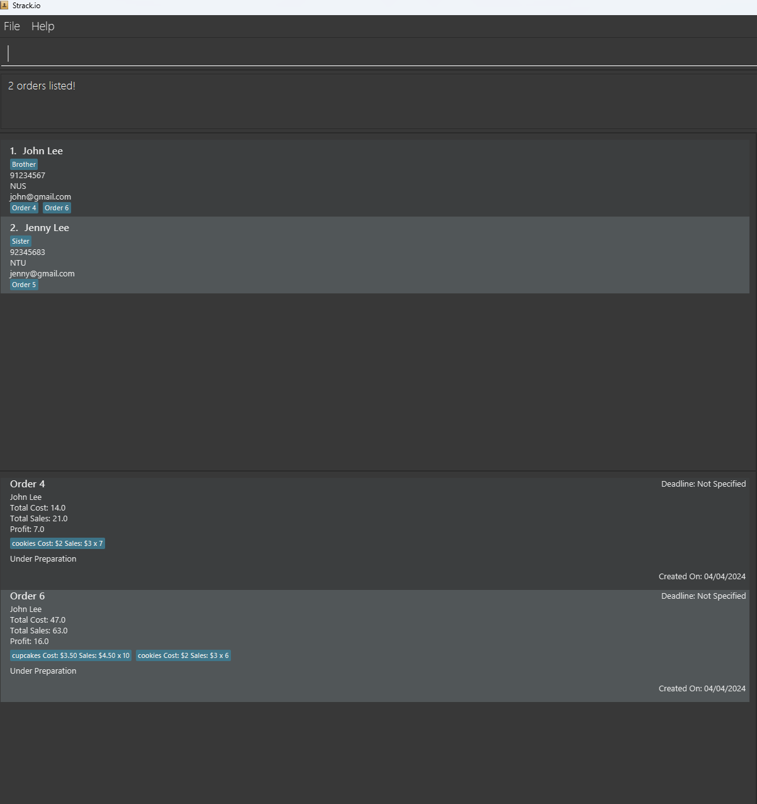

### Deleting a customer: `delete`

You can delete the specified customer from your address book.

Format: `delete c/CUSTOMER_ID`

* Deletes the customer of the specified `CUSTOMER_ID`.
* The customer_id refers to the number shown under customer id in the displayed customer contact.
* The customer_id **must be a positive integer** 1, 2, 3, …​

Examples:
* `list` followed by `delete c/2` deletes the person with customer_id of `2` in the address book.
* `find Betsy` followed by `delete c/1` deletes the person with customer_id of `1` in the results of the `find` command.
  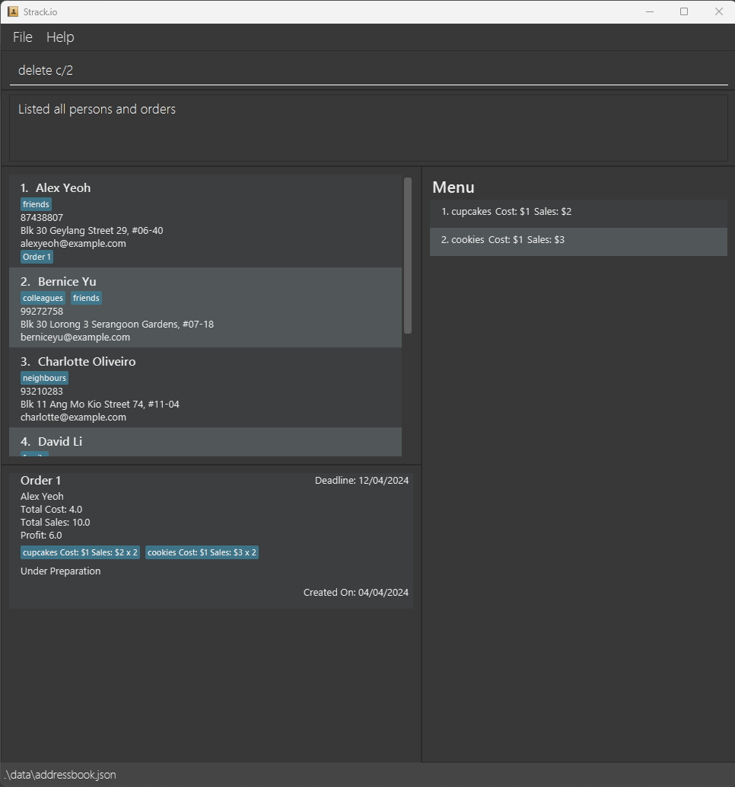
  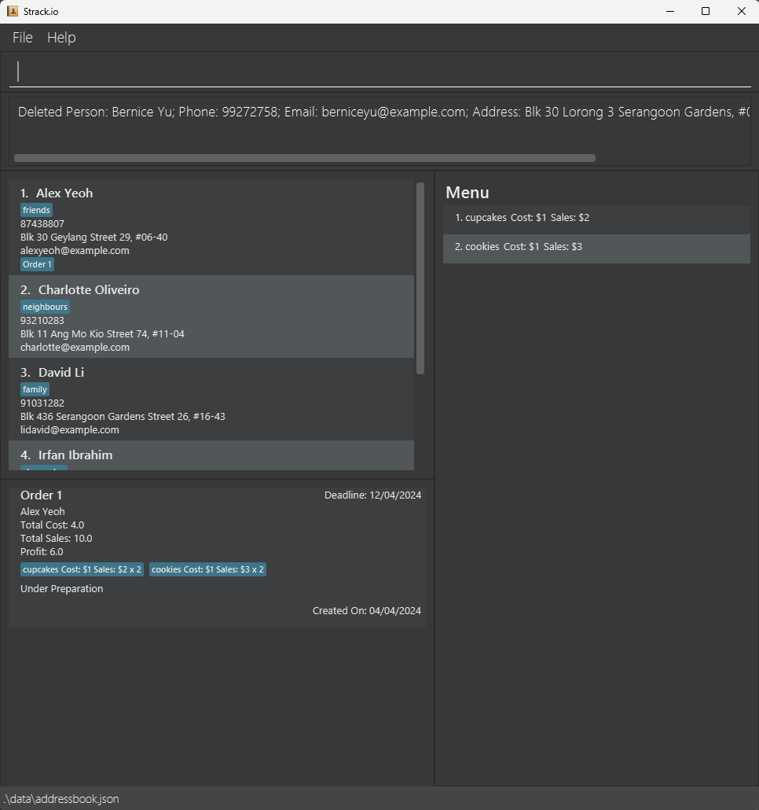

### Creating of orders: `order`

You can create and assign an order to a specified customer in the address book.

Format: `order p/PHONE_NUMBER [by/DEADLINE]`

* Orders are assigned to person with specified `PHONE_NUMBER`.
* `DEADLINE` is an optional fields that is used to keep track of an order's deadline
* * The format for deadline dates are dd/MM/yyyy
* For single digit days or months, please precede them with a zero.
* Leaving Deadline blank will make the order's deadline marked as `Not Specified`
* Strack will prompt users to input products using the product command
* Follow up with products to be added to the order using the following format. Format: `product m/PRODUCT_ID pq/PRODUCT_QUANTITY`.
* You can refer to the Menu list for the product index, i.e. `1. Cupcake` product index is `1`.
* This can be repeated as many times as necessary.

Examples:
* `order p/87438807 by/08/04/2024` will create an order for person with phone number `99887766` with a deadline `08/04/2024`, start adding products for the order to be shown.  

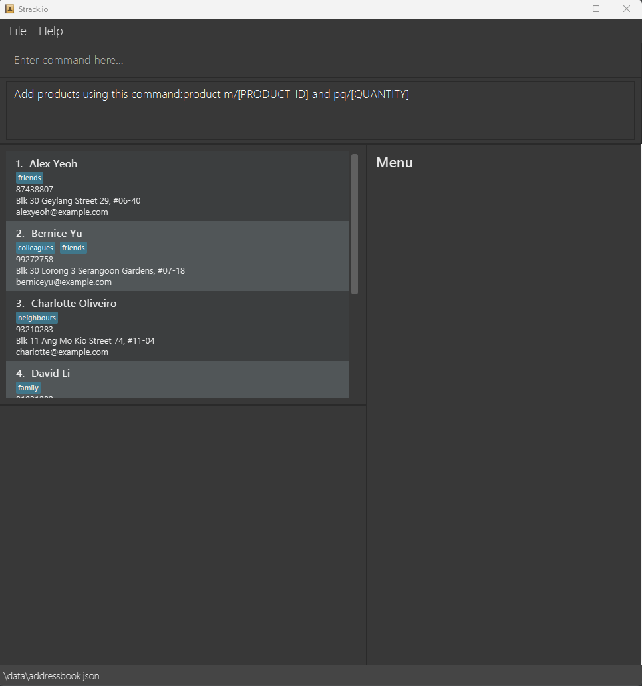
 

### Adding of products to order: `product`

You can add products on the menu into the most recently created order.

Format: `product m/MENU_ID pq/PRODUCT_QUANTITY`
* You can refer to the Menu list for the product index, i.e. `1. Cupcake` product index is `1`.
* This can be repeated as many times as necessary within one session of using Strack.io.
* This means closing the Strack.io will no longer allow you to add products to the order you created previously

Examples:
* Assuming you have already created an order in this session for the phone number `87438807`, using `product m/1 pq/2` and `product m/2 pq/2` will add products corresponding to `PRODUCT_ID` 1 and 2 in the menu, in this example it would be cupcakes and cookies respectively.  
  
  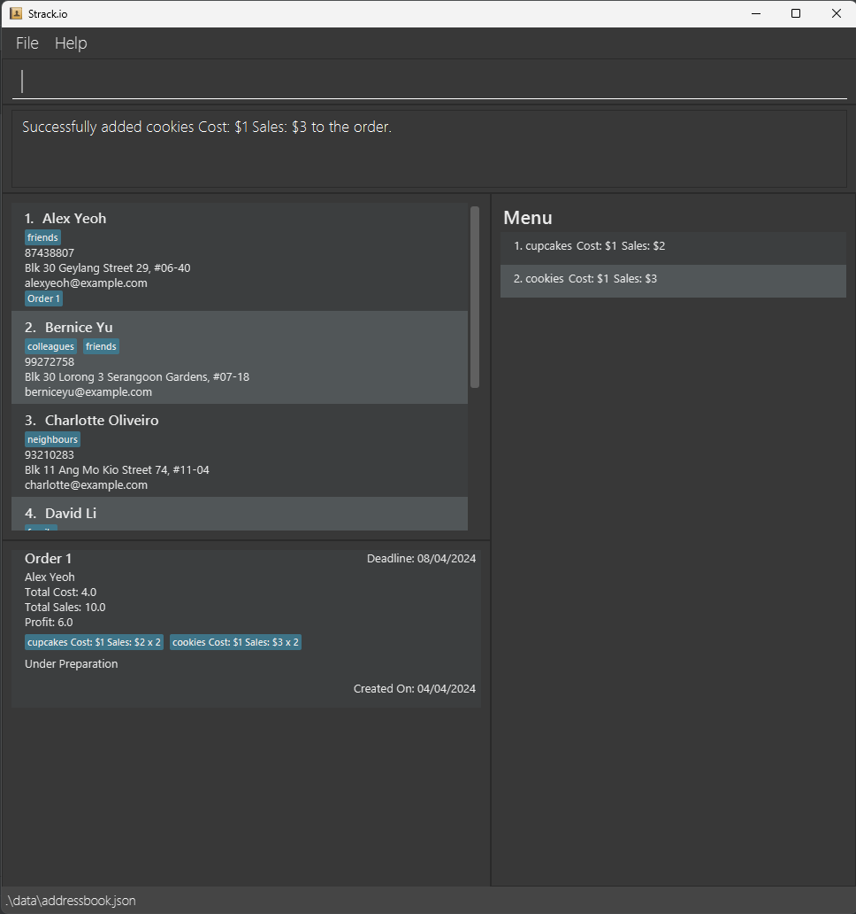
   

### Editing of an order's deadline: `edit`
You can edit the deadline of an existing order of a specific customer in your address book.

Format: `edit o/ORDER_ID by/DEADLINE`
* `ORDER_ID` is a unique number for each order.
* The order id refers to the number shown under order id in the displayed customer's contact.
* The format for deadline is dd/MM/yyyy

Example:
* `edit o/1 by/07/04/2024` or `edit o/1 by/12/10/2024` will edit the deadline of the order with order id 1 to `07/04/2024` or `12/10/2024` respectively.  
  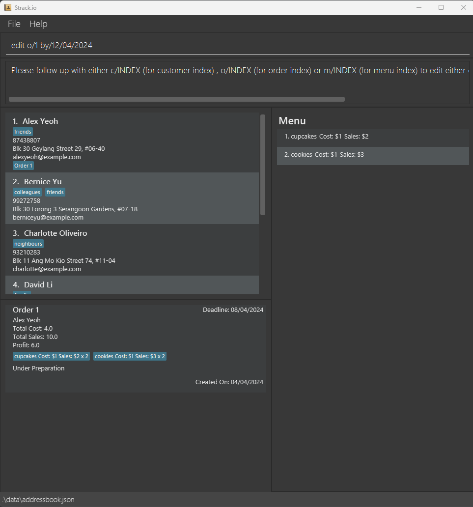
  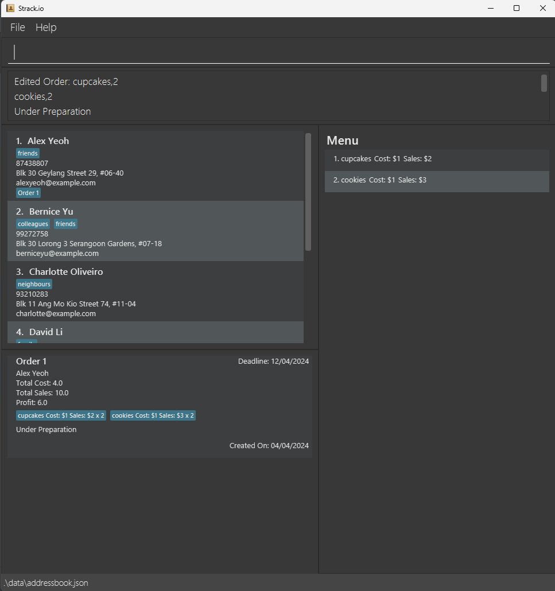
 

### Editing of orders: `edit`

You can edit an existing order of a specific customer in your address book.

Format: `edit o/ORDER_ID m/MENU_ID pq/PRODUCT_QUANTITY`

* `ORDER_ID` is a unique number for each order.
* The order id refers to the number shown under order id in the displayed customer's contact.
* Products are edited based on `MENU_ID`.
* To remove product from order, specify `PRODUCT_QUANTITY` as `0`.

Example:
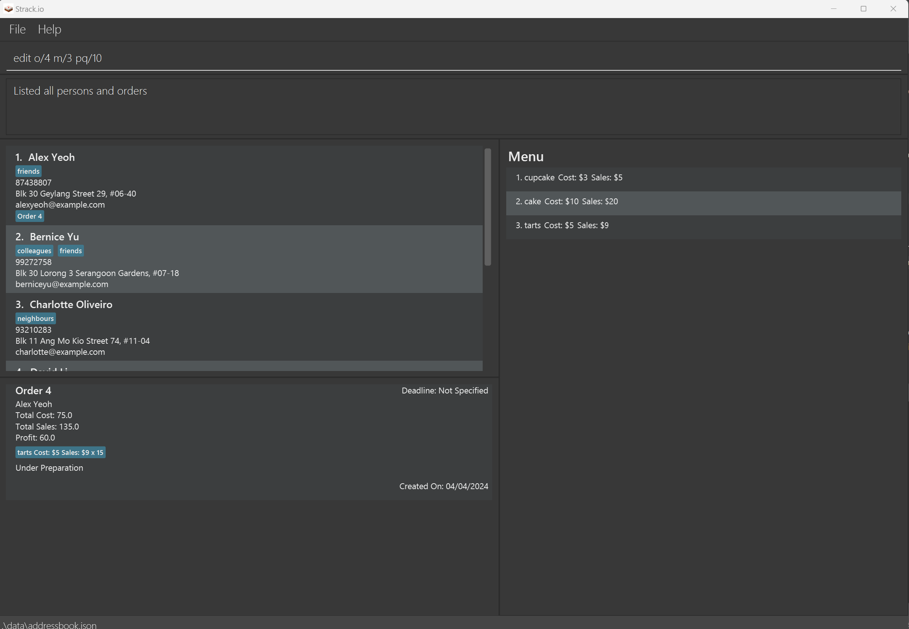
* `edit o/4 m/3 pq/10` will edit the order with order id of `4` and change the product associated with menu id of `3`
which is `tarts` quantity to `10`. 

### Staging of orders: `stage`

You can move an order to the next stage, in the chain of the four stages defined by Strack, in order namely: `Under Preparation`, `Ready for Delivery`,
`Sent for delivery` and `Received by customer`. However, you cannot go back to a previous stage.

Format: `stage o/ORDER`

* `ORDER_ID` is a unique number for each order.
* Any order just created will be in `Under Preparation` stage.

Example:
* Suppose the order with id 1 is in initial `Under Preparation` stage.
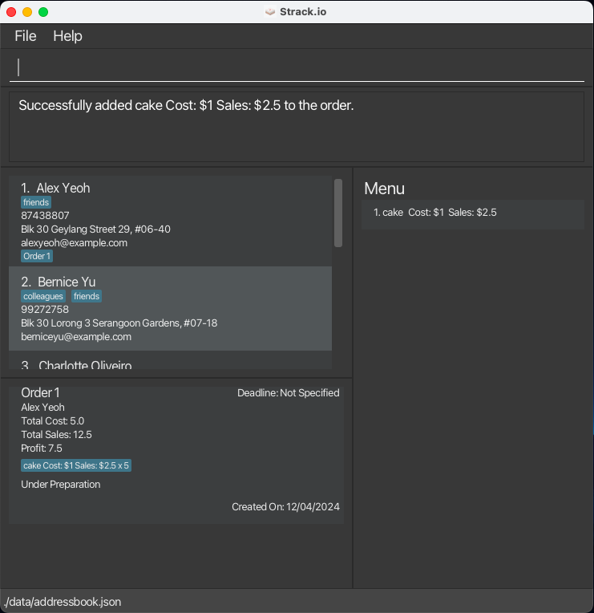

* Running `stage o/1` once will move the order with id 1 to `Ready for Delivery`.

* Running `stage o/1` three or more times will move the order with id 1 to `Received by customer`.
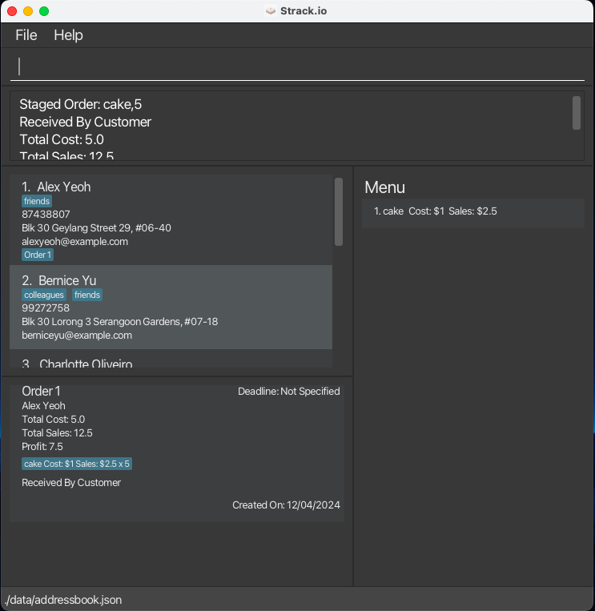

### Completion of orders: `complete`

You can demarcate an order in your address book as complete. Strack will collate completed orders into a csv file.
The csv file can be accessed in this directory: `[JAR file location]/data/completedorders.csv`

Format: `complete ORDER_ID`

* `ORDER_ID` refers to the number shown under order id in the displayed persons contact.

Example:
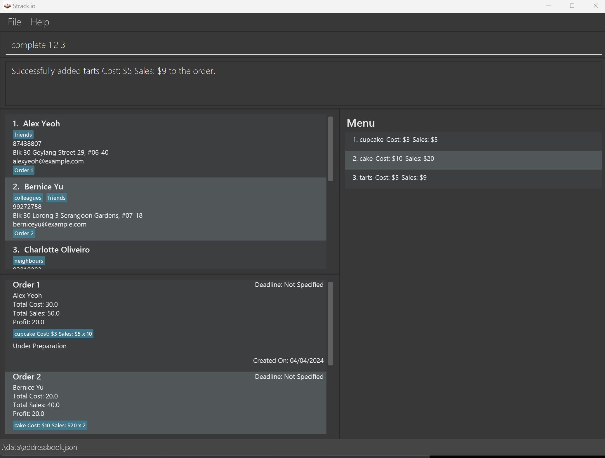
* `complete 1 2 3` will complete orders with `ORDER_ID`s of `1`, `2` and `3`.

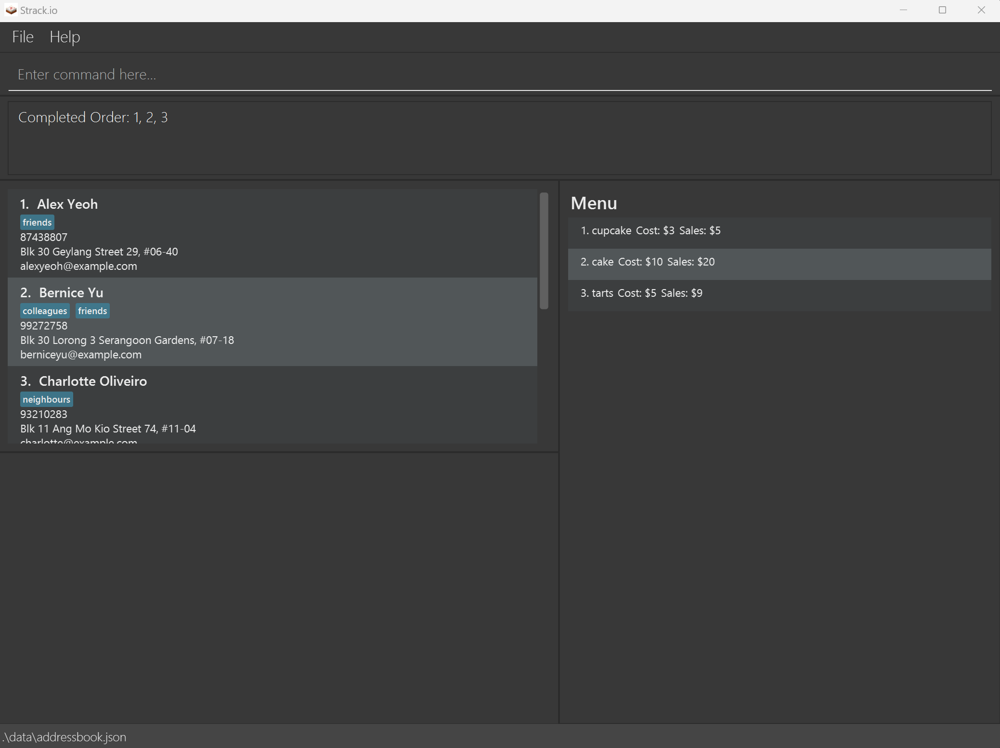
* This would be collated in the csv file in this directory: `[JAR file location]/data/completedorders.csv`

### Cancelling of orders: `cancel`

You can remove an ongoing order in your address book.

Format: `cancel ORDER_ID`

* `ORDER_ID` refers to the number shown under order id in the displayed persons contact.

Example:
* `cancel 19` will cancel order with `ORDER_ID` of `19`.
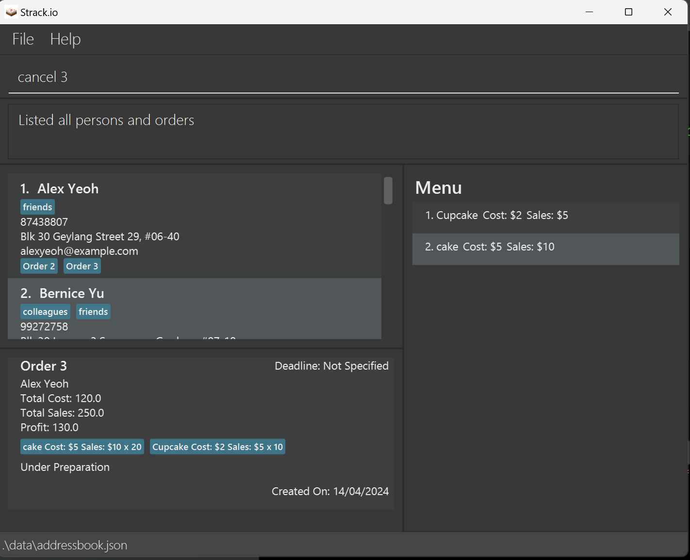
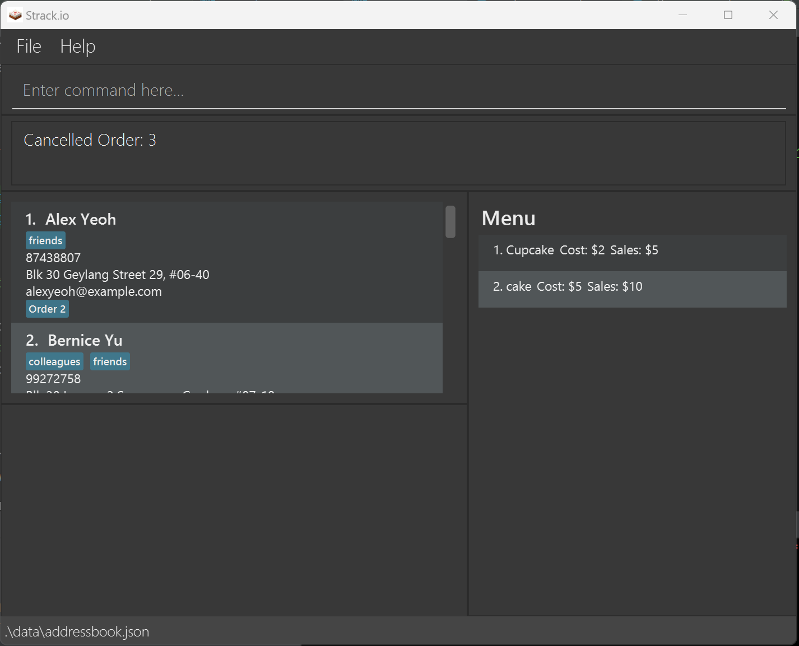
  
### Adding a product to the menu: `menu`

You can add a product to be displayed on the product menu.

Format: `menu pn/PRODUCT_NAME pc/PRODUCT_COSTS ps/PRODUCT_SALES`

* `PRODUCT_COSTS` refer to the costs incurred to make the product.
* `PRODUCT_SALES` refer to how much the product is being sold for.
* The order of which `pc/PRODUCT_COSTS` or `ps/PRODUCT_SALES` is being input does not matter.
* Decimals are supported.

Example:
* `menu pn/Cupcake pc/1 ps/2`
* `menu pn/Tart ps/6.30 pc/2.20`

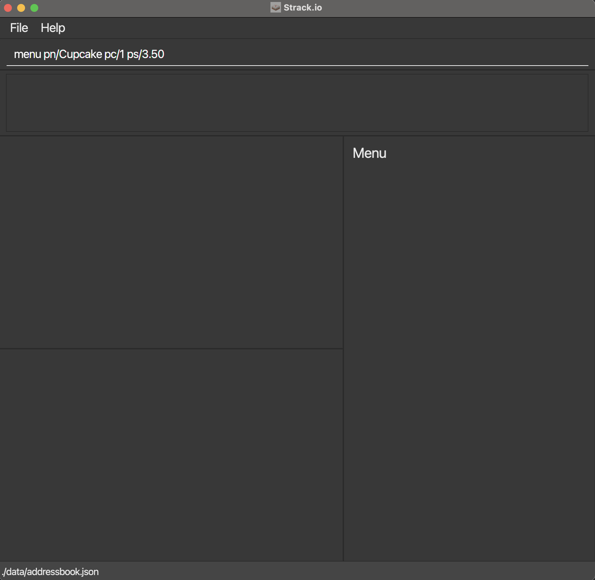
 

### Editing a product on the menu: `edit`

You can edit an existing product on the product menu.

Format: `edit m/MENU_ID [pn/PRODUCT_NAME] [pc/PRODUCT_COSTS] [ps/PRODUCT_SALES]`

* Edits the product of the specified `MENU_ID`. The `MENU_ID` refers to the number reflected on the product menu beside the product name. The `MENU_ID` **must be a positive integer** 1, 2, 3, ...
* At least one of the optional fields must be provided.
* Existing values will be updated to the input values.

Examples:
* `edit m/1 pn/Pie` Edits the product name of the product with `MENU_ID` of 1 to be `Pie`.
* `edit m/2 pc/5 ps/12` Edits the product costs and sales of the product with `MENU_ID` of 2 to be `5` and `12` respectively.

 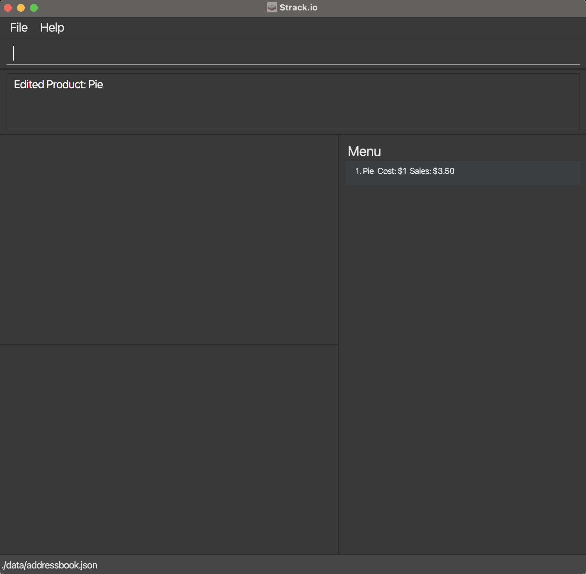

### Deleting a product from the menu: `delete`

You can delete the specified product from the product menu.

Format: `delete m/MENU_ID`

* Deletes the product of the specified `MENU_ID`.
* The `MENU_ID` refers to the number reflected on the product menu beside the product name.
* The `MENU_ID` **must be a positive integer** 1, 2, 3, ...

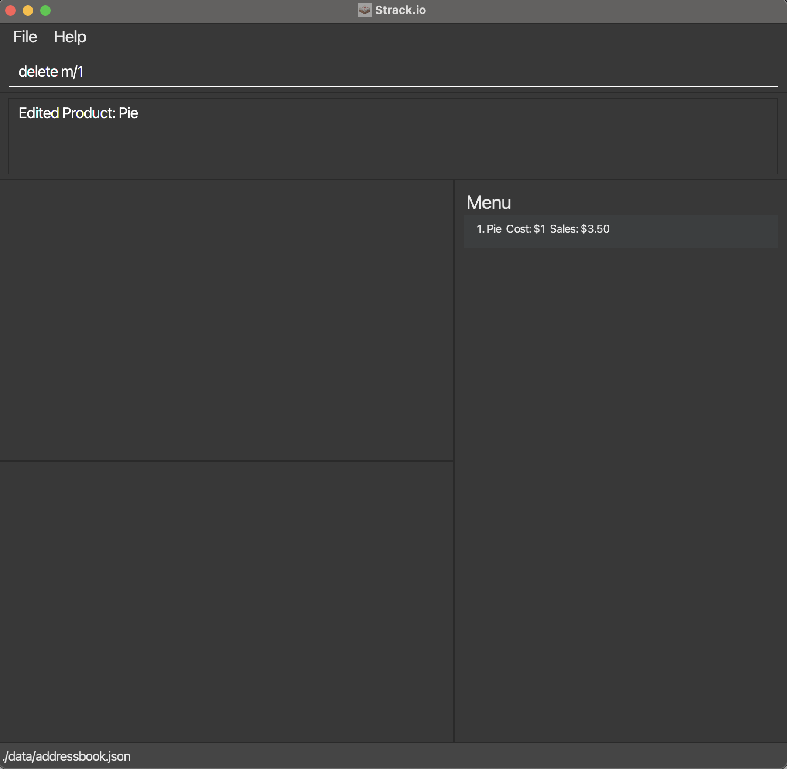
 

### Clearing all entries: `clear`

You can clear all entries from your address book.

Format: `clear`

### Exiting the program: `exit`

You can exit the program using a command.

Format: `exit`

### Saving the data

Strack.io data are saved in the hard disk automatically after any command that changes the data. There is no need to save manually.

### Editing the data file

Strack.io data are saved automatically as a JSON file `[JAR file location]/data/Strack.io.json`. Advanced users are welcome to update data directly by editing that data file.

:exclamation: **Caution:**
If your changes to the data file makes its format invalid, Strack.io will discard all data and start with an empty data file at the next run. Hence, it is recommended to take a backup of the file before editing it. 
Furthermore, certain edits can cause Strack.io to behave in unexpected ways (e.g., if a value entered is outside of the acceptable range). Therefore, edit the data file only if you are confident that you can update it correctly.

--------------------------------------------------------------------------------------------------------------------

## FAQ

**Q**: How do I transfer my data to another Computer? 
**A**: Install the app in the other computer and overwrite the empty data file it creates with the file that contains the data of your previous Strack.io home folder.

--------------------------------------------------------------------------------------------------------------------

## Known issues

1. **When using multiple screens**, if you move the application to a secondary screen, and later switch to using only the primary screen, the GUI will open off-screen. The remedy is to delete the `preferences.json` file created by the application before running the application again.

--------------------------------------------------------------------------------------------------------------------

## Command summary

Action | Format, Examples
--------|------------------
**Add** | `add n/NAME p/PHONE_NUMBER e/EMAIL a/ADDRESS [t/TAG]…​`   e.g., `add n/James Ho p/22224444 e/jamesho@example.com a/123, Clementi Rd, 1234665 t/friend t/colleague`
**Clear** | `clear`
**Delete customer** | `delete c/CUSTOMER_ID`  e.g., `delete c/3`
**Edit customer** | `edit c/CUSTOMER_ID [n/NAME] [p/PHONE_NUMBER] [e/EMAIL] [a/ADDRESS] [t/TAG]…​`  e.g.,`edit 2 n/James Lee e/jameslee@example.com`
**Find customer/order** | `find [n/NAME] [p/PHONE_NUMBER] [a/ADDRESS] [e/EMAIL] [o/ORDER_ID]`  e.g., `find James Jake`
**List all contacts and orders** | `list`
**Create order** | `order p/PHONE_NUMBER [by/DEADLINE]`
**Cancel order** | `cancel ORDER_ID`
**Complete order** | `complete ORDER_ID`
**Edit order** | `edit o/ORDER_ID m/MENU_ID pq/PRODUCT_QUANTITY`
**Edit order deadline** | `edit o/ORDER_ID by/DEADLINE`
**Add product to menu** | `menu pn/PRODUCT_NAME pc/PRODUCT_COSTS ps/PRODUCT_SALES`
**Edit product on menu** | `edit m/MENU_ID [pn/PRODUCT_NAME] [pc/PRODUCT_COSTS] [ps/PRODUCT_SALES]`
**Delete product on menu** | `delete m/MENU_ID`
**Help** | `help`
